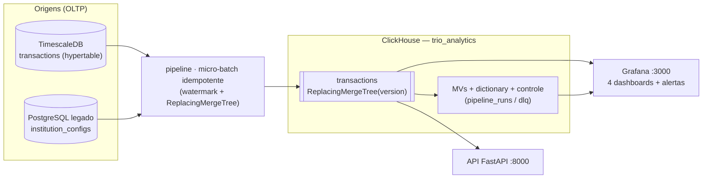

# Trio Data Challenge — Engenheiro de Dados Sênior

[](https://github.com/projetosdatabricksfree-png/case_trio/actions/workflows/ci.yml)

Réplica autocontida da plataforma de dados da **Trio** (instituição de pagamentos): **3 bancos +
pipeline + observabilidade**, tudo via `docker compose` e **validado de ponta a ponta no CI** a cada
push. Cobre os três desafios técnicos — performance/tuning, pipeline/arquitetura e
operação/resiliência — com a documentação como cidadã de primeira classe. Princípio-mestre: **tudo
defensável ao vivo** (terminal, código, dashboards).

> **Onde rodar:** o projeto deployável vive em
> [`desafioengenheirodedadostrio/trio-data-challenge/`](desafioengenheirodedadostrio/trio-data-challenge/).
> **Todos os comandos `docker compose`/`make` rodam a partir de lá.** Esta raiz guarda o
> planejamento (PRD, ROADMAP, sprints) e este índice de entrega.

## Arquitetura (as-built)



Diagramas completos (as-built + target AWS, com SLAs por hop e pontos de falha) em
[`desafio-2/diagrams/architecture.md`](desafioengenheirodedadostrio/trio-data-challenge/desafio-2/diagrams/architecture.md).

## Stack

| Serviço | Imagem | Porta | Papel |
|---|---|---|---|
| TimescaleDB | `timescale/timescaledb:latest-pg16` | 5432 | Transacional principal (`trio_transactions`) |
| PostgreSQL legado | `postgres:16-bookworm` | 5433 | Legado de referência (`trio_legado`) |
| ClickHouse | `clickhouse/clickhouse-server:latest` | 8123 / 9000 | Analítico (`trio_analytics`) |
| Grafana | `grafana/grafana:latest` | 3000 | Dashboards + alertas (admin/admin) |
| API | FastAPI + Uvicorn | 8000 | ClickHouse servindo aplicação |
| Pipeline | Python 3.12 | — | Micro-batch TimescaleDB → ClickHouse |

## Subir do zero

```bash
cd desafioengenheirodedadostrio/trio-data-challenge
cp .env.example .env
make up                 # sobe os 6 serviços e espera todos 'healthy'
make smoke              # valida os 6 serviços
```

Reproduzir cada desafio: ver **"Como demonstrar"** no
[README do entregável](desafioengenheirodedadostrio/trio-data-challenge/README.md#como-demonstrar-cada-parte)
e o [checklist de validação](desafioengenheirodedadostrio/trio-data-challenge/docs/validation-checklist.md).

## Índice de entregáveis

Mapa de cada parte do desafio → artefato → como rodar/demonstrar (caminhos relativos a
`desafioengenheirodedadostrio/trio-data-challenge/`).

| Desafio / Parte | RF | Artefato principal | Como rodar / demonstrar |
|---|---|---|---|
| **1** · TimescaleDB — modelagem & seed 10M | RF-1.1–1.3 | `desafio-1/schemas/`, `desafio-1/seed/`, [`REPORT.md` §1–2](desafioengenheirodedadostrio/trio-data-challenge/desafio-1/REPORT.md) | `make migrate seed index sanity` |
| **1** · CAggs, políticas & queries Q1–Q4 | RF-1.4–1.8 | `desafio-1/queries/`, [`REPORT.md` Sprint 02](desafioengenheirodedadostrio/trio-data-challenge/desafio-1/REPORT.md) | `make caggs policies queries` (EXPLAIN antes/depois) |
| **1** · Migração PostgreSQL → Aurora/RDS | RF-2.x | [`migration-analysis.md`](desafioengenheirodedadostrio/trio-data-challenge/desafio-1/migration-analysis.md) | leitura: opções, matriz, runbook 72h, rollback |
| **1** · ClickHouse (engine, MVs, dict) + API | RF-3.x | `desafio-1/schemas/clickhouse/`, `desafio-1/api/`, [`REPORT.md` Sprint 04](desafioengenheirodedadostrio/trio-data-challenge/desafio-1/REPORT.md) | `make migrate-ch seed-ch queries-ch` · `curl :8000/...` |
| **2** · Pipeline TS → CH (idempotente, DLQ) | RF-4.x | `desafio-2/pipeline/`, [`ADR.md`](desafioengenheirodedadostrio/trio-data-challenge/desafio-2/ADR.md), [`diagrams/`](desafioengenheirodedadostrio/trio-data-challenge/desafio-2/diagrams/architecture.md) | `make migrate-pipeline pipeline-once pipeline-mutation-demo` |
| **3** · Backup & recovery dos 3 bancos | RF-5.1–5.2 | `desafio-3/backup/`, [`recovery-demo.md`](desafioengenheirodedadostrio/trio-data-challenge/desafio-3/backup/recovery-demo.md) | `make backup recovery-demo` |
| **3** · Runbook de storage (92%) | RF-5.3 | [`runbook.md`](desafioengenheirodedadostrio/trio-data-challenge/desafio-3/runbook.md) | `make runbook-storage-check` (read-only) |
| **3** · Dashboards Grafana (≥2 no CH) | RF-5.4 | `desafio-3/grafana/provisioning/dashboards/` | Grafana :3000 → pasta **Trio** (4 dashboards) |
| **3** · Alertas críticos + integração AWS | RF-5.5 | [`alerts.md`](desafioengenheirodedadostrio/trio-data-challenge/desafio-3/alerts.md) | 7 alertas + 1 PoC provisionada no Grafana |
| **3** · Incidente SEV-1 (volume zero) | RF-5.6 | [`incident-response.md`](desafioengenheirodedadostrio/trio-data-challenge/desafio-3/incident-response.md) | `make incident-demo` (reproduzível) |

## Decisões-chave (resumo)

- **Pipeline = micro-batch Python idempotente** (watermark + `ReplacingMergeTree`), não CDC — 100%
  demonstrável no compose; CDC (Debezium + MSK) é a evolução-alvo. → [ADR-0002](desafioengenheirodedadostrio/trio-data-challenge/desafio-2/ADR.md)
- **ClickHouse engine = `ReplacingMergeTree(version)`** — trata mutação de status sem `UPDATE`.
- **Hypertable chunk = 1 dia**; compressão 7d, retenção raw 90d (pausada como guard de demo), CAggs 2a.
- **Migração do legado = RDS Multi-AZ** (baixo volume); Aurora só com gatilho de escala/DR.
  → [migration-analysis.md](desafioengenheirodedadostrio/trio-data-challenge/desafio-1/migration-analysis.md)
- **Versões = ambiente fornecido pelo escopo** (ClickHouse `latest` intencional); pinagem por digest
  fica para produção. → [ADR-0001](desafioengenheirodedadostrio/trio-data-challenge/docs/adr/ADR-0001-image-versioning.md)

## Apresentação ao vivo

Roteiro de 30–45 min (terminal + dashboards) + respostas para as perguntas-âncora:
[`docs/presentation-script.md`](desafioengenheirodedadostrio/trio-data-challenge/docs/presentation-script.md).

## Estrutura do repositório

```
case_trio/                                  # raiz: planejamento + entrega
├── PRD.md · ROADMAP.md · sprints/          # requisitos, 8 sprints (00–07), 42 stories
├── .github/workflows/ci.yml                # lint + integração (sobe a stack e valida cada desafio)
└── desafioengenheirodedadostrio/
    └── trio-data-challenge/                # >>> projeto deployável (rode tudo daqui) <<<
        ├── docker-compose.yml · Makefile · scripts/
        ├── desafio-1/                       # TimescaleDB, ClickHouse, API, migração (REPORT, queries)
        ├── desafio-2/                       # pipeline, ADR, diagramas
        ├── desafio-3/                       # backup/recovery, runbook, dashboards, alertas, incidente
        └── docs/                            # ADRs, roteiro de apresentação, checklist de validação
```

## CI/CD

A cada push/PR para `main`: job **Lint & validate** (compose config, shellcheck, yamllint, gitleaks) +
job **Integration** que sobe a stack com `--wait` e roda, em sequência, as asserções de **todos os
desafios** (seed → queries → ClickHouse → pipeline idempotente → backup/recovery → dashboards/alertas →
**incidente SEV-1**). O job de integração é a prova viva de que o ambiente sobe e funciona do zero.
