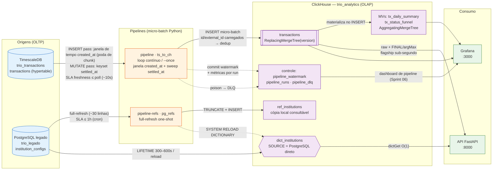
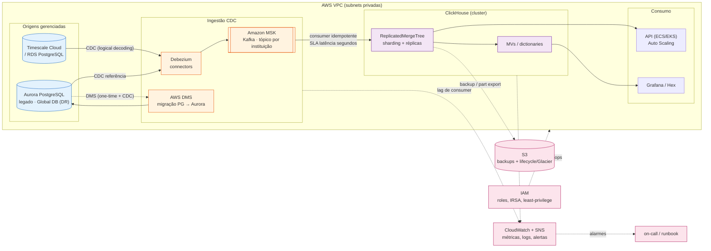

# Arquitetura de Dados — Diagramas (Desafio 2 · Story 5.5)

Dois diagramas: **(1) as-built** — exatamente o que sobe no `docker-compose` e é
defensável ao vivo — e **(2) target AWS** — a evolução cloud-native (CDC, sharding,
DR) discutida no [ADR](../ADR.md). Fluxos da origem ao consumo, com **SLAs por hop**
e **pontos de falha + mitigação** anotados.

---

## 1) As-built (docker-compose) — o que roda hoje

**Pontos de falha & mitigação (as-built):**

| Hop | Falha | Mitigação implementada |
|---|---|---|
| TS → pipeline | banco indisponível / query lenta | retry + backoff exponencial; leitura por **janela de tempo** (poda de chunk na hypertable comprimida) + índice `(settled_at, id)` para o sweep de mutações |
| pipeline → CH | INSERT falha / CH down | retry + backoff; watermark **não** avança sem confirmar o batch → reprocessa |
| pipeline (dado) | registro poison (fora do domínio) | validação por linha → **DLQ** (`pipeline_dlq`), não trava o batch |
| re-sincronização | mutação duplicaria a linha | `id` carregado da origem + `ReplacingMergeTree(version)` → versão maior vence |
| leitura mutável | versão antiga visível antes do merge | `FINAL`/`argMax(version)` na query crítica; `OPTIMIZE … FINAL` agendável |
| dict desatualizado | mudança em institution_configs | `LIFETIME` + `SYSTEM RELOAD DICTIONARY` disparado pelo pipeline de referência |

**Decisão central:** **micro-batch idempotente** (watermark + ReplacingMergeTree), não
CDC — 100% demonstrável no compose. Justificativa e plano de escala no [ADR](../ADR.md).

---

## 2) Target AWS — evolução cloud-native (10x+)

**O que muda da as-built para a target (e o que NÃO muda):**

- **Pipeline principal:** micro-batch Python → **CDC (Debezium + MSK)** para latência de
  segundos e throughput horizontal (tópico por instituição). O **contrato de dados** e a
  semântica de idempotência (dedup por `ReplacingMergeTree`) permanecem.
- **ClickHouse:** `MergeTree` single-node → **`ReplicatedMergeTree` + sharding** (escala de
  escrita/leitura, alta disponibilidade).
- **Legado:** PostgreSQL → **Aurora** via **DMS**; o pipeline de referência **só troca a
  connection string** (Aurora é wire-compatible) — lógica intacta.
- **Operação:** logs JSON + tabelas de controle → **CloudWatch + SNS** (alertas), **S3**
  (backups com lifecycle), **IAM** (least-privilege), **Aurora Global Database** (DR).

> SLAs-alvo: freshness do pipeline **segundos** (CDC) vs. **≤ ~poll+batch** (micro-batch
> atual); query analítica **sub-segundo** (mantida pelo design de `ORDER BY`/partição).
